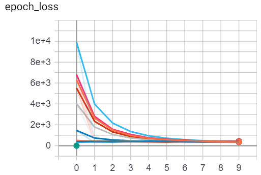

# FlowNet in TensorFlow 2.0

FlowNetSimple model from the [Computer Vision Group of Freiburg](https://lmb.informatik.uni-freiburg.de/Publications/2015/DFIB15/flownet.pdf).

On the road to implementing something like this: [Consistent video depth estimation](https://roxanneluo.github.io/Consistent-Video-Depth-Estimation/), I read [this](https://arxiv.org/pdf/2006.02535.pdf) which led me to [this](https://www.cv-foundation.org/openaccess/content_cvpr_2016/papers/Mayer_A_Large_Dataset_CVPR_2016_paper.pdf) which stemmed from this [Flownet architecture](https://lmb.informatik.uni-freiburg.de/Publications/2015/DFIB15/flownet.pdf).

NB: A very high level summary of the FlowNet architecture can be found on [Towards Data Science](https://towardsdatascience.com/a-brief-review-of-flownet-dca6bd574de0).

This implementation was done in Tensorflow2.0/Keras and should be fairly straight forward.  The model is trained on the [Flying Chairs dataset](https://lmb.informatik.uni-freiburg.de/resources/datasets/FlyingChairs.en.html) which takes a few days to download but it's *only* ~32GB packed and 60GB unpacked.

One epoch with data augmentation took ~4hrs on a GTX 1070 8GB.

The FlowNetS implementation performed better in most scenarios that the FlowNetCorr model.  For the sake of time, currently only the FlowNetS model has been implemented.

## Training figures

Full network architecture:

Epoch loss curve for an early implementation of the model:

